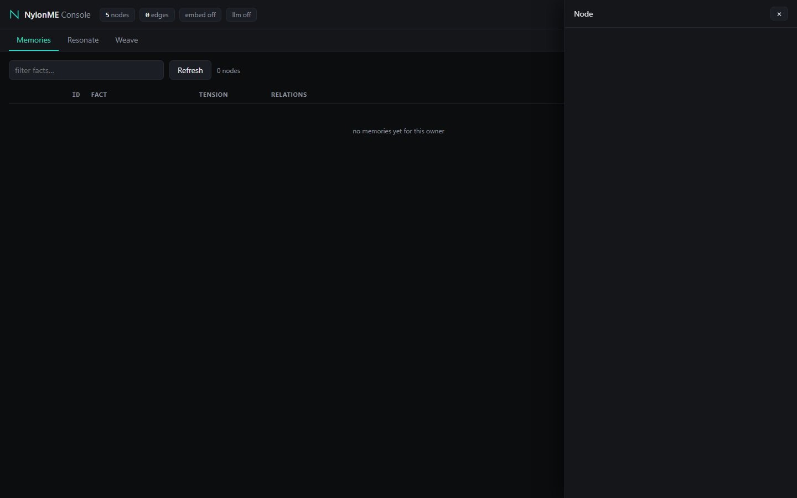

# Getting Started with NylonME

[English] | 这篇文档带你 5 分钟跑起 NylonME：下载预编译二进制或从源码构建，启动引擎，写入并召回第一条记忆。

## Option A: Docker Compose (one command)

Prerequisites: Docker with the compose plugin. No Rust, no protoc.

```bash
git clone https://github.com/nylon-memory/NylonME.git
cd NylonME
docker compose up -d
```

This builds the engine image locally and starts three containers: `engine` (gRPC :50051 + web console/REST :50052), `ollama`, and a one-shot `ollama-pull` job that fetches the `bge-m3` embedding model. First start takes a few minutes (Rust release build + model download).

To skip the local build entirely, use the published image:

```bash
docker compose -f docker-compose.prebuilt.yml up -d
```

Optional: enable the LLM weaving/reflection layer by exporting `NYLON_LLM_API_KEY` before `up` (DeepSeek `deepseek-v4-flash` is preconfigured; override `NYLON_LLM_URL`/`NYLON_LLM_MODEL` for any OpenAI-compatible endpoint).

Data persists in the `nylon-data` named volume. Open http://localhost:50052 for the web console.
## Option B: Download a prebuilt release (no build tools)

Grab the latest archive for your platform from [GitHub Releases](https://github.com/nylon-memory/NylonME/releases):

| Asset | Platform |
|---|---|
| `nylonme-linux-x64.tar.gz` | Linux x86_64 |
| `nylonme-windows-x64.zip` | Windows x86_64 |
| `nylonme-macos-arm64.tar.gz` | Apple Silicon |

Each archive contains:

- `nylon-engine` — the gRPC memory engine daemon
- `nylon_cli` — a small CLI for weaving and resonating memories
- `smoke_client` — a 4-RPC end-to-end smoke test

## Option C: Build from source

Prerequisites: Rust (stable), `protoc`, and on Linux also `clang` + `libclang-dev` (needed by the RocksDB bindings).

```bash
# Debian/Ubuntu
sudo apt install -y protobuf-compiler clang libclang-dev pkg-config libssl-dev
# macOS
brew install protobuf

git clone https://github.com/nylon-memory/NylonME.git
cd NylonME/engine
cargo build --release -p nylon-engine --example nylon_cli
```

## Run the engine

Minimal (in-memory embeddings off, LLM off):

```bash
NYLON_DATA_DIR=./data ./nylon-engine serve 0.0.0.0:50051
```

Recommended (semantic recall via an ollama embedding model):

```bash
ollama pull bge-m3   # any OpenAI-compatible / ollama endpoint works
NYLON_DATA_DIR=./data \
NYLON_EMBED_URL=http://localhost:11434 NYLON_EMBED_MODEL=bge-m3 NYLON_EMBED_DIMS=1024 \
./nylon-engine serve 0.0.0.0:50051
```

Optional understanding layer (session-level fact weaving with any OpenAI-compatible chat model):

```bash
NYLON_LLM_URL=https://api.deepseek.com/v1/chat/completions \
NYLON_LLM_MODEL=deepseek-v4-flash NYLON_LLM_API_KEY=<your-key> NYLON_LLM_THINKING_OFF=1 \
./nylon-engine serve 0.0.0.0:50051
```

The same binary also serves a **web console + REST API** on `http://127.0.0.1:50052` (override with `NYLON_HTTP_ADDR`, set to `off` to disable). Open it in a browser to browse memories with live tension, debug resonance queries, and weave by hand. REST spec: [api/openapi.json](api/openapi.json).



Verify with the smoke test (runs weave + get_node + resonate + search):

```bash
NYLON_SERVER=http://127.0.0.1:50051 ./smoke_client
# -> SMOKE_OK
```

## Your first memory (CLI)

```bash
export NYLON_SERVER=http://127.0.0.1:50051

# write
./nylon_cli weave --owner alice --task travel --fact "Alice prefers window seats on business trips"
# -> NODE_ID=0

# recall
./nylon_cli resonate --owner alice --query "flight seat preference" --budget 5
# -> ACTIVATED=1
# -> 0  0.812  Alice prefers window seats on business trips
```

`--owner` scopes memories (use a person or project slug). `--tenant` defaults to `codex` and isolates datasets.

## Integrating with your agent / IDE

Any tool that can run a shell command or speak gRPC can use NylonME:

- **Shell-capable agents** (Codex, Cursor, Aider, scripts): call `nylon_cli` with `NYLON_SERVER` pointing at the engine. Recall at task start, weave at milestones.
- **gRPC-native integrations**: the contract is [proto/nylon/v1/memory.proto](../proto/nylon/v1/memory.proto) — `Weave`, `WeaveSession`, `Resonate`, `Search`, `GetNode`.
- **Codex users**: see the `nylonme-memory` plugin pattern — a small skill that teaches the agent when to recall and what to persist. The same pattern ports to any agent framework with custom instructions.

Good facts are self-contained sentences with names, numbers, and paths. Never weave secrets (API keys, passwords).

## Python SDK

`nylon-sdk` wraps the gRPC contract in sync + async clients:

```bash
pip install ./sdk/python    # from this repo
```

```python
from nylon_sdk import NylonClient

with NylonClient("127.0.0.1:50051", owner="alice") as client:
    client.weave("Alice prefers window seats on business trips")
    for node in client.resonate("flight seat preference", budget=5).activated:
        print(node.filaments.fact)
```

Batch session ingestion uses `client.weave_session([...])`; bring your own
embeddings with `client.search(embedding, top_k=10)`. Full API surface:
[sdk/python/README.md](../sdk/python/README.md).

## Tuning

See the [README](../README.md#tuning-knobs-env-vars) for the full env-var knob table (`NYLON_MAX_SEEDS`, `NYLON_CAT{n}_MAX_HOPS`, `NYLON_RERANK_VEC`, ...).
## Use it from your AI agent in 2 minutes (MCP)

`nylon-engine mcp` speaks the [Model Context Protocol](https://modelcontextprotocol.io) over stdio with the engine **embedded** — no daemon, no ports, data lands in `~/.nylonme/data` automatically. Any MCP-capable client (Claude Code, Cursor, Codex, VS Code Copilot, ...) can use it directly.

Claude Code:

```bash
claude mcp add nylonme -- /path/to/nylon-engine mcp
```

Cursor / VS Code (`.cursor/mcp.json` or MCP settings):

```json
{
  "mcpServers": {
    "nylonme": {
      "command": "/path/to/nylon-engine",
      "args": ["mcp"],
      "env": { "NYLON_OWNER": "my-project" }
    }
  }
}
```

Codex (`~/.codex/config.toml`):

```toml
[mcp_servers.nylonme]
command = "/path/to/nylon-engine"
args = ["mcp"]

[mcp_servers.nylonme.env]
NYLON_OWNER = "my-project"
```

The agent then gets three tools: `memory_weave` (persist a fact), `memory_resonate` (recall related memories), `memory_get` (read a node by id).

### Share one engine across machines (remote bridge)

Set `NYLON_SERVER` and the same `mcp` subcommand becomes a thin bridge: every tool call is forwarded to the remote engine over gRPC, the local process holds **no data**, and multiple machines/IDEs share one memory store:

```json
{
  "mcpServers": {
    "nylonme": {
      "command": "/path/to/nylon-engine",
      "args": ["mcp"],
      "env": {
        "NYLON_SERVER": "192.168.1.5:50051",
        "NYLON_OWNER": "my-project"
      }
    }
  }
}
```

The remote side is just the normal daemon (`nylon-engine serve 0.0.0.0:50051`). In bridge mode the embedding/LLM env vars belong on the server — the client side only needs `NYLON_SERVER`, `NYLON_OWNER` and optionally `NYLON_TENANT`.

Optional env for MCP mode: `NYLON_DATA_DIR` (default `~/.nylonme/data`), `NYLON_OWNER` (default memory namespace), `NYLON_EMBED_URL`/`NYLON_EMBED_MODEL`/`NYLON_EMBED_DIMS` (semantic recall via ollama), `NYLON_LLM_*` (session-level fact weaving).
